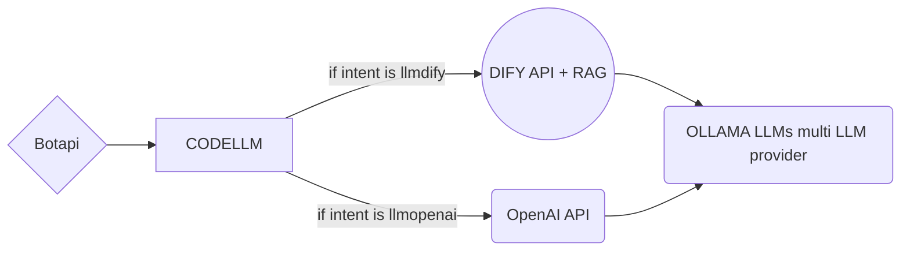
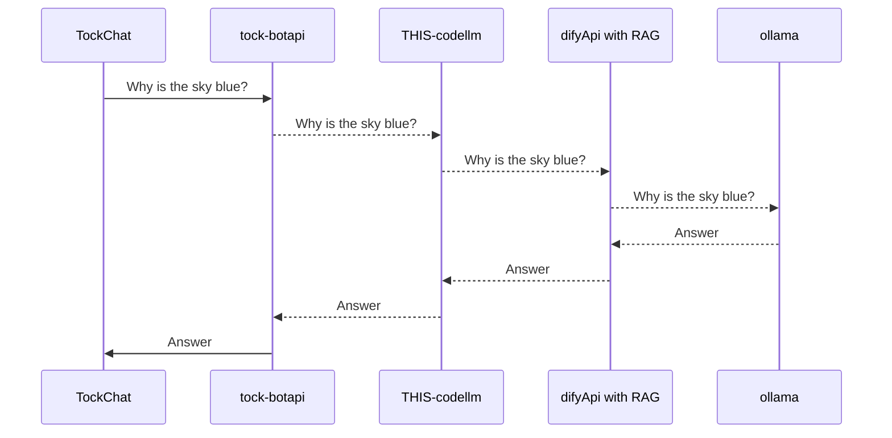

# tock-botapi-llm-demo

Able to link [TOCK](https://doc.tock.ai/) intents through botapi webhook/websocket call

Two Differents intents (customisable in bot.kt):

- llmdify: a LLM OPS platform you can deploy with docker or a helm chart

- llmopenai: any llm that provide an openAI API compliant endpoint (ollama, vllm etc)

## Diagrams

flow chart:

Call will use this sequence diagram:

# Environment settings TOCK BOTAPI

TOCK_BOT_API_KEY: "apikey"

# Environment settings LLM OpenAI

OPENAI_API_TOKEN: "mytoken"

OPENAI_API_BASE: "http://openai_api_url/v1/"

OPENAI_API_MODEL: "model_to_use"

OPENAI_SYSTEM_PROMPT: "Tu réponds exclusivement en français de manière professionnelle et toujours positive"

# Environment settings LLM Dify
DIFY_API_KEY: mytoken

DIFY_BASE_URL: https://dify.my-api-server.fr/v1

 # Dockerfile

Provide a docker file that enable to build containers

  

Theses containers are generic and if you just create intents llmdify or llmopenai, you will be able to use this code to follow to ai services.

  

Dify libraries are included as they were not available on maven when this code has been written, most is from https://github.com/langgenius/java-client but i 've had to fix some issues.'

  # Code

- A sample html file for the chat widget : [web/index.html](web/index.html)

- Simple kotlin-based bot implementation

- [common](common/src/main/kotlin/bot.kt)

- [websocket](websocket/src/main/kotlin/StartWebsocket.kt)

- [webhook](webhook/src/main/kotlin/StartWebhook.kt)

  
  

update common\src\main\kotlin\bot.kt to customise intents names with your needs
